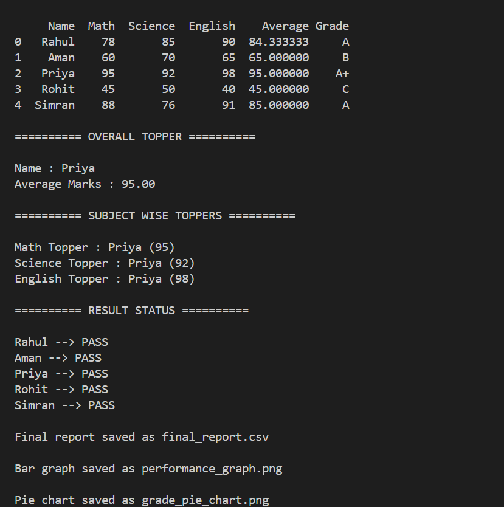
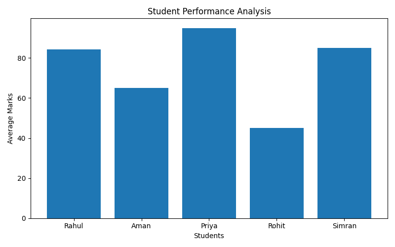
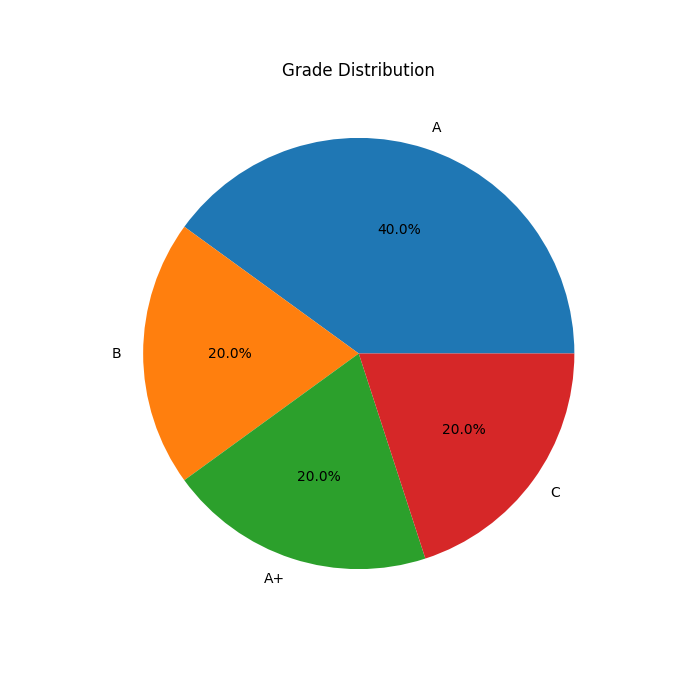

# student-performance-analyzer
Developed a Student Performance Analyzer using Python, Pandas, and Matplotlib to perform academic data analysis, grade prediction, topper identification, and graphical visualization.

## Features
- Average marks calculation
- Grade system
- Subject-wise topper analysis
- Pass/Fail analysis
- Bar graph visualization
- Pie chart visualization

## Technologies Used
- Python
- Pandas
- Matplotlib

## Screenshots

### Terminal Output

### Bar Graph

### Pie Chart

